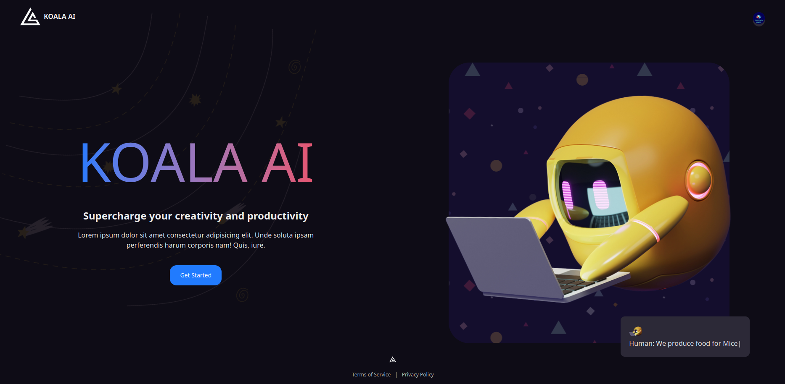
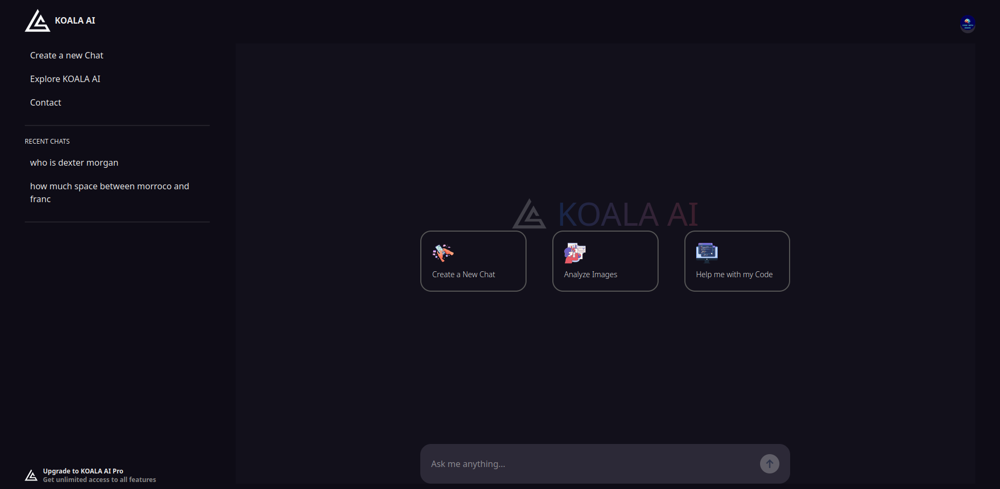
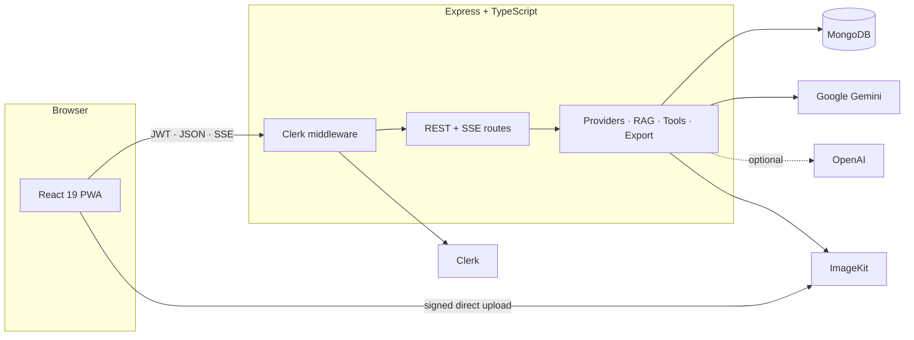

<p align="center">
  
</p>

<h1 align="center">KOALA AI</h1>

<p align="center">
  A fast, friendly AI assistant that chats, understands images, searches the web and answers from your own documents.
</p>

<p align="center">
  <a href="https://github.com/ZahaAnass/KOALA-AI/actions/workflows/ci.yml"></a>
  <a href="LICENSE"></a>
  = 20" src="https://img.shields.io/badge/node-%3E%3D20-brightgreen.svg" />
  <a href="CONTRIBUTING.md"></a>
</p>

---

## Screenshots

| Landing                             | Dashboard                                | Chat                            |
| ----------------------------------- | ---------------------------------------- | ------------------------------- |
|  |  |  |

## Features

**Chat experience**

- Streaming answers over Server-Sent Events, with stop, regenerate and edit-and-resend
- Markdown rendering with GFM tables, KaTeX math, syntax-highlighted code with copy buttons and Mermaid diagrams
- Suggested follow-up questions after each answer
- Image understanding: drop, paste or attach up to four images per message
- Image generation with Gemini, saved straight into the conversation
- Voice input (Web Speech API) and read-aloud playback

**Knowledge and tools**

- Web search grounding with cited sources
- Function-calling tools the model invokes on its own: calculator, weather, current date and time
- Retrieval-augmented answers over your uploaded PDF, TXT, MD, CSV and JSON documents
- URL summarization: paste a link, get the readable text turned into a prompt
- Rolling memory: long chats are summarized automatically so context never overflows

**Organization**

- Full-text search across all chats, with snippets
- Pin, archive, tags and folders
- Public read-only share links that can be revoked at any time
- Export a chat as Markdown, JSON or PDF
- Bulk delete and one-click "clear all history"

**Personalization**

- Model selector: Gemini 2.5 Flash, Flash-Lite and Pro, plus GPT-4o and GPT-4o mini when an OpenAI key is set
- Custom instructions globally and per chat
- Creativity (temperature), answer length and safety-filter controls
- Reusable prompt templates, built-in and your own
- Dark, light and system themes; English and French

**Admin and operations**

- Per-user daily message quotas and usage analytics with charts
- Admin dashboard: platform stats, user search, role and quota management
- Clerk authentication with server-side JWT signature verification and webhook sync
- Account deletion that wipes every piece of user data

**Platform**

- Installable progressive web app with offline shell
- Keyboard shortcuts and a command palette (`Ctrl/⌘ + K`)
- Onboarding tour for first-time users
- OpenAPI documentation served by the API

## Architecture


```mermaid
flowchart LR
  subgraph Browser
    SPA[React 19 PWA]
  end
  subgraph API["Express + TypeScript"]
    Auth[Clerk middleware]
    Routes[REST + SSE routes]
    Services[Providers · RAG · Tools · Export]
  end
  DB[(MongoDB)]
  Gemini[Google Gemini]
  OpenAI[OpenAI]
  IK[ImageKit]
  Clerk[Clerk]

  SPA -- "JWT · JSON · SSE" --> Auth --> Routes --> Services
  Services --> DB
  Services --> Gemini
  Services -. optional .-> OpenAI
  Services --> IK
  Auth --> Clerk
  SPA -- signed direct upload --> IK
```

The browser never talks to the model directly. Every generation goes through the API, which verifies the session, enforces quotas, assembles context (memory summary, documents, images) and streams the answer back as SSE events.

## Tech stack

| Layer     | Technology                                                                                       |
| --------- | ------------------------------------------------------------------------------------------------ |
| Client    | React 19, TypeScript, Vite 7, Tailwind CSS 4, React Router 7, TanStack Query 5, Zustand, i18next  |
| Rendering | react-markdown, remark-gfm, remark-math, rehype-katex, rehype-highlight, Mermaid, Recharts       |
| Server    | Node 20+, Express 4, TypeScript, Mongoose 8, zod, helmet, express-rate-limit, pino, swagger-ui   |
| AI        | `@google/genai` (Gemini 2.5, `gemini-embedding-001`, `gemini-2.5-flash-image`), OpenAI via fetch |
| Auth      | Clerk (`@clerk/clerk-react`, `@clerk/express`, svix webhooks)                                     |
| Storage   | MongoDB, ImageKit                                                                                |
| Tooling   | ESLint 9, Prettier, Husky, lint-staged, Vitest, Supertest, Playwright, Docker, GitHub Actions    |

## Quick start

**Prerequisites**

- Node.js 20 or newer
- A MongoDB database ([Atlas free tier](https://www.mongodb.com/atlas) or `mongod` locally)
- A [Clerk](https://clerk.com) application (publishable and secret keys)
- A Gemini API key from [Google AI Studio](https://aistudio.google.com/app/apikey)
- Optional: an [ImageKit](https://imagekit.io) account for image uploads, an OpenAI key for GPT models

**Install and run**

```bash
git clone https://github.com/ZahaAnass/KOALA-AI.git
cd KOALA-AI
npm install

cp server/.env.example server/.env   # fill in MONGO_URI, CLERK_*, GEMINI_API_KEY
cp client/.env.example client/.env   # fill in VITE_CLERK_PUBLISHABLE_KEY

npm run dev
```

| Service  | URL                             |
| -------- | ------------------------------- |
| Client   | http://localhost:5173           |
| API      | http://localhost:3000           |
| API docs | http://localhost:3000/api/docs  |

To load demo data for a Clerk user id, run `npm run seed -- --user <clerkUserId> --admin`.

## Docker

```bash
cp .env.docker.example .env
cp server/.env.example server/.env   # fill in the same keys as above
docker compose up --build
```

The client is served on http://localhost:8080 and proxies `/api` to the server container. MongoDB runs in the `mongo` service with a persistent volume.

## Environment variables

**Server (`server/.env`)**

| Variable                 | Required | Default                   | Description                                                 |
| ------------------------ | -------- | ------------------------- | ----------------------------------------------------------- |
| `NODE_ENV`               | no       | `development`             | `development`, `test` or `production`                       |
| `PORT`                   | no       | `3000`                    | HTTP port                                                   |
| `LOG_LEVEL`              | no       | `info`                    | pino log level                                              |
| `CLIENT_URL`             | no       | `http://localhost:5173`   | Comma-separated allowed browser origins (CORS)              |
| `MONGO_URI`              | yes      |                           | MongoDB connection string                                   |
| `CLERK_PUBLISHABLE_KEY`  | yes      |                           | Clerk publishable key                                       |
| `CLERK_SECRET_KEY`       | yes      |                           | Clerk secret key, used to verify session JWTs               |
| `CLERK_WEBHOOK_SECRET`   | no       |                           | Enables `POST /api/webhooks/clerk` user sync                |
| `GEMINI_API_KEY`         | yes      |                           | Chat, image generation, embeddings and web search grounding |
| `OPENAI_API_KEY`         | no       |                           | Adds GPT-4o models to the picker                            |
| `DEFAULT_MODEL`          | no       | `gemini-2.5-flash`        | Model used when none is selected                            |
| `IMAGE_KIT_END_POINT`    | no       |                           | ImageKit URL endpoint; uploads are disabled when missing    |
| `IMAGE_KIT_PUBLIC_KEY`   | no       |                           | ImageKit public key                                         |
| `IMAGE_KIT_PRIVATE_KEY`  | no       |                           | ImageKit private key                                        |
| `ADMIN_EMAILS`           | no       |                           | Comma-separated emails granted the admin role               |
| `DAILY_MESSAGE_QUOTA`    | no       | `200`                     | Messages per user per day                                   |
| `MAX_HISTORY_MESSAGES`   | no       | `400`                     | Maximum messages stored per chat                            |
| `RATE_LIMIT_WINDOW_MS`   | no       | `60000`                   | Rate-limit window                                           |
| `RATE_LIMIT_MAX`         | no       | `120`                     | Requests per window per token/IP                            |

**Client (`client/.env`)**

| Variable                     | Required | Description                                                          |
| ---------------------------- | -------- | -------------------------------------------------------------------- |
| `VITE_API_URL`               | no       | API base URL; leave empty to use the Vite dev proxy to port 3000     |
| `VITE_CLERK_PUBLISHABLE_KEY` | yes      | Clerk publishable key                                                |

## Scripts

Run from the repository root. Add `-w client` or `-w server` to target one workspace.

| Script                 | What it does                                             |
| ---------------------- | -------------------------------------------------------- |
| `npm run dev`          | Starts the API and the client with hot reload            |
| `npm run build`        | Builds both workspaces                                   |
| `npm run lint`         | ESLint for both workspaces                               |
| `npm run typecheck`    | TypeScript checks for both workspaces                    |
| `npm test`             | Unit and integration tests for both workspaces           |
| `npm run test:e2e -w client` | Playwright end-to-end tests                        |
| `npm run format`       | Prettier across the repository                           |
| `npm run seed`         | Seeds demo chats and templates (see `server/src/scripts/seed.ts`) |

## Testing

- **Server**: Vitest + Supertest against an in-memory MongoDB (`mongodb-memory-server`). Covers auth guards, chats, sharing, exports, documents, tools, users and admin. Run `npm test -w server`.
- **Client**: Vitest with jsdom for the SSE parser and utilities. Run `npm test -w client`.
- **End-to-end**: Playwright smoke tests for the public pages. Requires a Clerk publishable key in `client/.env`. Run `npm run test:e2e -w client`.

## API

Interactive docs live at `/api/docs` (Swagger UI) and the raw spec at `/api/openapi.json`. A full reference is in [docs/API.md](docs/API.md).

| Area      | Endpoints                                                                                             |
| --------- | ----------------------------------------------------------------------------------------------------- |
| Health    | `GET /health`, `GET /ready`                                                                           |
| Chats     | `GET/POST/DELETE /api/chats`, `GET/PATCH/DELETE /api/chats/:id`, `/meta`, `/bulk-delete`, `/export`    |
| Messages  | `POST /api/chats/:id/messages`, `PUT …/:messageId`, `POST …/:messageId/regenerate`, `…/feedback`      |
| Share     | `POST/DELETE /api/chats/:id/share`, `GET /api/share/:token`                                            |
| Documents | `GET/POST /api/documents`, `POST /api/documents/search`, `DELETE /api/documents/:id`                   |
| Users     | `GET/DELETE /api/users/me`, `PATCH /api/users/me/settings`, `GET /api/users/me/usage`                  |
| Admin     | `GET /api/admin/stats`, `GET /api/admin/users`, `PATCH/DELETE /api/admin/users/:id`                    |
| Misc      | `/api/models`, `/api/prompts`, `/api/tools/url`, `/api/tools/calculate`, `/api/images/generate`, `/api/upload` |

Generation endpoints stream `text/event-stream` with `meta`, `chunk`, `sources`, `tool`, `done` and `error` events. Closing the connection stops generation.

## Deployment

See [docs/DEPLOYMENT.md](docs/DEPLOYMENT.md) for Docker Compose on a VPS, Vercel + Render/Railway, MongoDB Atlas, and Clerk production setup.

## Documentation

- [Architecture](docs/ARCHITECTURE.md): folder layout, request flow, memory, RAG, data models
- [API reference](docs/API.md)
- [Deployment guide](docs/DEPLOYMENT.md)
- [Original specification](docs/SPECIFICATION.md) (French)
- [Changelog](CHANGELOG.md)

## Roadmap

- Redis-backed caching and rate limiting for multi-instance deployments
- Sentry error tracking on both apps
- Multi-image generation and image editing
- Native mobile app built on the same API
- Atlas Vector Search for large document libraries

## Contributing

Contributions are welcome. Read [CONTRIBUTING.md](CONTRIBUTING.md) for setup, conventions and the pull-request checklist, and [CODE_OF_CONDUCT.md](CODE_OF_CONDUCT.md) for community expectations.

## License

[MIT](LICENSE)

## Author

**Anass Zaha** · [GitHub @ZahaAnass](https://github.com/ZahaAnass) · [LinkedIn](https://www.linkedin.com/in/zaha-anas-101796334/)
