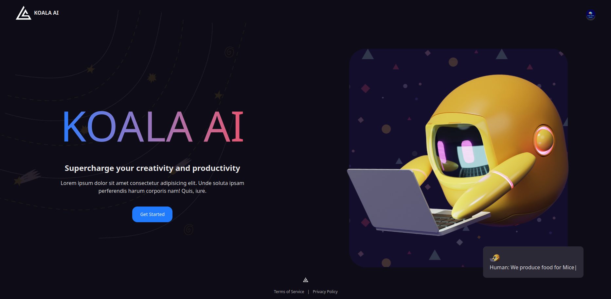
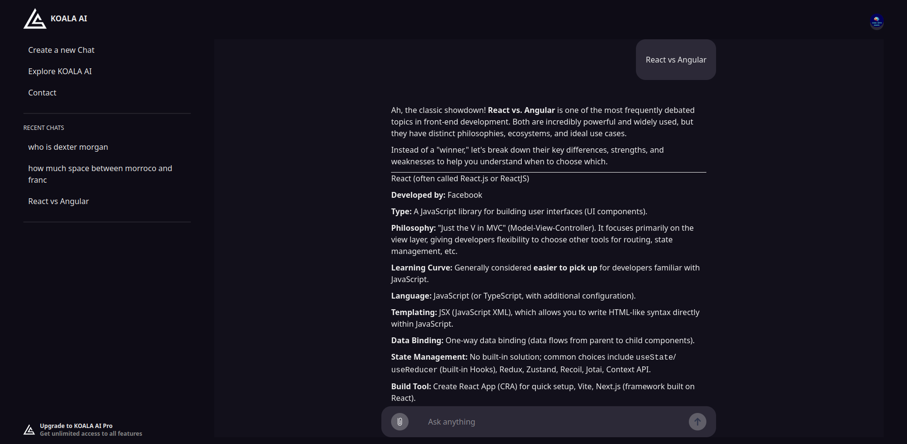
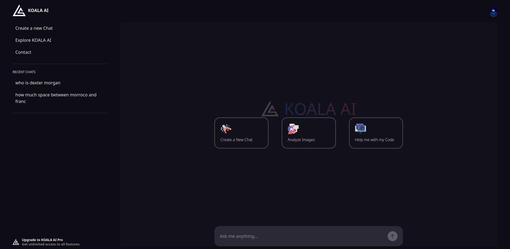

# Cahier des Charges Logiciel

## 1. Informations générales

**Titre du projet : Koala Ai**  
**Chef de projet : Anass Zaha**  
**Date : 11/10/2025**
**Version : 1.0**

## Résumé exécutif

KOALA AI est une application web d’intelligence artificielle visant à offrir une expérience de chat avancée entre l’utilisateur et un modèle IA (Google Gemini).  
Le projet repose sur une architecture client-serveur moderne (React + Node.js + MongoDB) et intègre des services tiers tels que Clerk pour l’authentification et ImageKit pour la gestion des médias.  
L’objectif est de proposer une interface fluide, sécurisée et évolutive, adaptée aux besoins des utilisateurs professionnels et grand public.

### Interfaces utilisateur





---

## 2. Introduction

### 2.1 Contexte

KOALA AI est une application de chatbot intelligente développée pour fournir une interface conversationnelle avancée utilisant l'intelligence artificielle. Le projet répond au besoin croissant d'assistants IA personnalisés capables de comprendre et de répondre à des requêtes variées, incluant l'analyse d'images et la génération de contenu.

### 2.2 Objectifs

- Créer un chatbot IA conversationnel intuitif et performant
- Permettre l'upload et l'analyse d'images via IA
- Offrir une expérience utilisateur moderne et responsive
- Gérer l'historique des conversations de manière persistante
- Fournir une authentification sécurisée des utilisateurs

### 2.3 Portée du projet

**Fonctionnalités incluses :**
- Interface de chat en temps réel avec IA (Google Gemini)
- Authentification utilisateur (Clerk)
- Upload et analyse d'images (ImageKit)
- Historique des conversations
- Interface responsive moderne

**Fonctionnalités non prévues dans cette version :**
- Chat vocal/audio
- Intégration avec d'autres modèles IA
- Fonctionnalités collaboratives multi-utilisateurs

---

## 3. Présentation générale

- **Type d’application :** Application Web Progressive (SPA)
- **Utilisateurs cibles :** Administrateurs, utilisateurs authentifiés, visiteurs
- **Environnement technique prévu :** Navigateurs modernes, desktop et mobile
- **Technologies principales :** React, Node.js, Express, MongoDB, TailwindCSS, Clerk, ImageKit, Google Gemini AI

---

## 4. Fonctionnalités principales

1. **Authentification sécurisée** (Clerk Authentication)
   - Connexion / Inscription
   - Gestion des sessions utilisateur
   
2. **Interface de chat IA conversationnelle**
   - Communication en temps réel avec Google Gemini AI
   - Streaming des réponses
   - Formatage Markdown des messages
   
3. **Gestion des conversations**
   - Création de nouvelles conversations
   - Historique des chats persistant
   - Titre automatique des conversations
   
4. **Upload et analyse d'images**
   - Upload d'images via ImageKit
   - Analyse d'images par IA
   - Prévisualisation des images uploadées
   
5. **Tableau de bord utilisateur**
   - Vue d'ensemble des conversations récentes
   - Accès rapide aux fonctionnalités
   - Interface moderne et intuitive

---

## 5. Exigences fonctionnelles

- Le système doit permettre à un utilisateur de créer un compte.
- L’administrateur peut consulter et modifier les informations des utilisateurs.
- L’utilisateur peut télécharger ses rapports au format PDF.

### 5.1 Authentification et gestion utilisateur
- L'utilisateur peut se créer un compte via Clerk
- L'utilisateur peut se connecter/déconnecter de manière sécurisée
- L'accès au tableau de bord nécessite une authentification

### 5.2 Fonctionnalités de chat
- L'utilisateur peut créer une nouvelle conversation
- L'utilisateur peut poser des questions à l'IA et recevoir des réponses en temps réel
- Le système doit sauvegarder automatiquement l'historique des conversations
- L'utilisateur peut accéder à ses conversations précédentes

### 5.3 Gestion des images
- L'utilisateur peut uploader des images (formats : PNG, JPG, JPEG)
- L'IA doit pouvoir analyser et commenter les images uploadées
- Les images doivent être stockées de manière sécurisée via ImageKit

### 5.4 Interface utilisateur
- L'interface doit être responsive et s'adapter aux différents appareils
- Les messages doivent être formatés en Markdown
- L'utilisateur doit pouvoir naviguer entre les différentes conversations :** Application Web Progressive (SPA)
- **Utilisateurs cibles :** 
  - Utilisateurs finaux cherchant un assistant IA
  - Développeurs et créateurs de contenu
  - Professionnels nécessitant une analyse d'images IA
- **Environnement technique prévu :** 
  - Navigateurs modernes (Chrome, Firefox, Safari, Edge)
  - Appareils desktop et mobiles
  - Compatible avec les systèmes d'exploitation principauxons générales

---

## 6. Exigences non fonctionnelles

### 6.1 Performance
- Temps de réponse de l'IA inférieur à 5 secondes
- Streaming des réponses pour une expérience fluide
- Chargement initial de l'application inférieur à 3 secondes

### 6.2 Sécurité
- Authentification sécurisée via Clerk (OAuth, JWT)
- Validation des tokens d'authentification côté serveur
- Sécurisation des uploads d'images via ImageKit
- Protection CORS configurée

### 6.3 Compatibilité
- Compatible avec les navigateurs modernes (Chrome 90+, Firefox 88+, Safari 14+, Edge 90+)

### 6.4 Utilisabilité
- Interface intuitive et moderne avec TailwindCSS
- Navigation fluide entre les pages
- Animations et transitions pour améliorer l'UX

---

## 7. Contraintes techniques

### 7.1 Frontend
- **Framework :** React 19 (RC)
- **Routing :** React Router DOM v7
- **Styling :** TailwindCSS v4
- **Build Tool :** Vite
- **Authentification :** Clerk React
- **State Management :** TanStack React Query (pour la gestion du cache)
- **Autres :** React Type Animation, React Markdown

### 7.2 Backend
- **Runtime :** Node.js avec TypeScript
- **Framework :** Express.js
- **Base de données :** MongoDB avec Mongoose
- **Authentification :** Clerk SDK Node
- **Upload d'images :** ImageKit
- **IA :** Google Generative AI (Gemini)

### 7.3 Infrastructure et services externes
- **Hébergement d'images :** ImageKit
- **Service IA :** Google Gemini API
- **Authentification :** Clerk Authentication Service
- **Base de données :** MongoDB Atlas (recommandé)

### 7.4 Variables d'environnement requises
- `VITE_CLERK_PUBLISHABLE_KEY`
- `VITE_IMAGE_KIT_END_POINT`, `VITE_IMAGE_KIT_PUBLIC_KEY`
- `VITE_GEMINI_PUBLIC_KEY`
- `MONGO_URI`, `CLIENT_URL`
- `IMAGE_KIT_PRIVATE_KEY`

---

## 8. Modèles et diagrammes

- Diagramme des cas d’utilisation
- Diagramme de classes UML
- Maquettes de l’interface utilisateur

### 8.1 Architecture système
- **Architecture :** Client-Serveur (SPA + API REST)
- **Frontend :** React SPA servie par Vite
- **Backend :** API REST avec Express.js et TypeScript
- **Base de données :** MongoDB (NoSQL)

### 8.2 Modèles de données

**Chat Model :**
```typescript
{
  userId: string,
  history: [
    {
      role: "user" | "model",
      parts: [{ text: string }],
      img?: string
    }
  ],
  timestamps: Date
}
```

**UserChats Model :**
```typescript
{
  userId: string,
  chats: [
    {
      _id: string,
      title: string,
      createAt: Date
    }
  ],
  timestamps: Date
}
```

### 8.3 Routes API
- `POST /api/chats` - Créer un nouveau chat
- `GET /api/chats/:id` - Récupérer un chat spécifique
- `PUT /api/chats/:id` - Mettre à jour un chat
- `GET /api/userchats` - Récupérer tous les chats d'un utilisateur
- `GET /api/upload` - Authentification pour upload d'imagesdoit permettre à un utilisateur de créer un compte via ImageKit
- L'utilisateur peut se connecter/déconnecter de manière sécurisée
- L'accès au tableau de bord nécessite une authentification
---

## 9. Planification du projet

| Phase                              | Durée estimée | Statut    |
| ---------------------------------- | ------------- | --------- |
| Analyse des besoins et conception  | 3 jours       | ✅ Terminé |
| Configuration de l'environnement   | 2 jours       | ✅ Terminé |
| Développement Frontend (React)     | 8 jours       | Équipe | ✅ Terminé |
| Développement Backend (Express/TS) | 6 jours       | Équipe | ✅ Terminé |
| Intégration services externes      | 4 jours       | ✅ Terminé |
| Tests et validation                | 3 jours       | 🔄 En cours |
| Documentation                      | 2 jours       | Chef de | 🔄 En cours |
| Déploiement et mise en production  | 2 jours       | Chef de | ⏳ À venir |

**Total estimé :** 30 jours

---

## 10. Livrables attendus

### 10.1 Livrables techniques
- ✅ Code source complet du projet (Frontend React + Backend Express/TS)
- ✅ Configuration des services externes (Clerk, ImageKit, Google Gemini)
- ✅ Base de données MongoDB avec modèles définis
- ✅ API REST documentée et fonctionnelle

### 10.2 Documentation
- ✅ README avec instructions d'installation
- ✅ Cahier des charges technique
- 🔄 Documentation API (Swagger/OpenAPI)
- ⏳ Manuel utilisateur
- ⏳ Guide de déploiement

### 10.3 Environnements
- ✅ Environnement de développement configuré
- 🔄 Environnement de staging/test
- ⏳ Environnement de production

---

## 11. Validation et tests

### 11.1 Critères d'acceptation
- ✅ Authentification utilisateur fonctionnelle
- ✅ Interface de chat responsive et intuitive
- ✅ Intégration IA (Google Gemini) opérationnelle
- ✅ Upload et analyse d'images fonctionnels
- ✅ Sauvegarde persistante des conversations
- 🔄 Performance conformes aux exigences
- ⏳ Tests de sécurité validés

---

## Annexes

### A. Configuration requise
- Node.js 18+ 
- MongoDB 5+
- Comptes configurés : Clerk, ImageKit, Google AI

### B. Scripts de développement
```bash
# Frontend (client)
npm run dev    # Serveur de développement
npm run build  # Build de production

# Backend (server)  
npm run dev    # Serveur avec hot-reload
npm run build  # Compilation TypeScript
npm start      # Production
```
