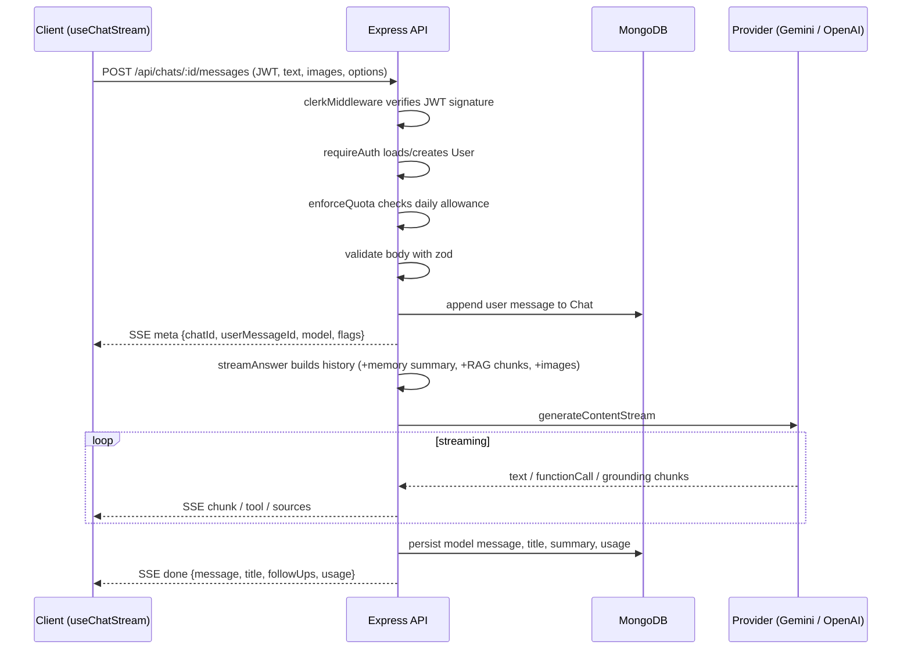

# Architecture

KOALA AI is a two-tier application: a React single-page app talks to an Express API, which owns every call to the model providers and the database. The browser never holds an AI key.

## Repository layout

```
koala-ai/
├── client/                 React 19 + Vite PWA (TypeScript)
├── server/                 Express API (TypeScript, ESM)
├── docs/                   This documentation
├── .github/                CI workflow, Dependabot, issue/PR templates
├── docker-compose.yml      Mongo + server + client
└── package.json            npm workspaces root
```

### Client (`client/src`)

```
src/
├── App.tsx                 Route table (lazy-loaded pages)
├── main.tsx                Entry: providers, service worker registration
├── index.css               Tailwind 4 theme tokens, dark mode, prose styles
├── i18n/                   i18next setup, en.json, fr.json
├── lib/
│   ├── api.ts              Typed API client, SSE streaming helpers, ImageKit upload
│   ├── sse.ts              Server-Sent Events parser over fetch streams
│   ├── queryClient.ts      TanStack Query client and query keys
│   └── utils.ts            cn(), formatting, grouping, clipboard helpers
├── store/
│   ├── chat.ts             Zustand: active generation, composer options, follow-ups
│   └── ui.ts               Zustand: sidebar, theme, palette, composer insert queue
├── hooks/
│   ├── useChatStream.ts    Drives a streamed generation and commits it to the cache
│   ├── useChats.ts         Chat list/detail queries and mutations, export download
│   ├── useUser.ts          Current user, settings mutation, models
│   ├── useHotkeys.ts       Keyboard shortcut registration
│   ├── useSpeech.ts        Speech-to-text and text-to-speech
│   └── usePwa.ts           Install prompt, online status
├── components/
│   ├── ui/                 Button, Form controls, Dialog, Menu, Feedback primitives
│   ├── layout/             AppShell (auth guard + shortcuts), Sidebar, Header, Providers
│   ├── chat/               Composer, Message, Markdown, CodeBlock, MermaidBlock,
│   │                       MessageExtras, ModelPicker, ChatMenu, ChatDialogs
│   ├── search/             CommandPalette
│   ├── onboarding/         OnboardingTour
│   ├── analytics/          UsageChart (Recharts)
│   └── auth/               AuthLayout, Clerk appearance
├── pages/                  Landing, SignIn, SignUp, Dashboard, Chat, Settings,
│                           Documents, Prompts, Usage, Admin, Share, Contact, NotFound
├── types/api.ts            Shared API types
└── test/                   Vitest setup and unit tests
```

### Server (`server/src`)

```
src/
├── app.ts                  Express app factory: security, logging, CORS, routes
├── server.ts               Bootstrap: DB connect, listen, graceful shutdown
├── config/                 env.ts (zod-validated), db.ts, logger.ts (pino)
├── middleware/
│   ├── auth.ts             Clerk middleware, requireAuth, requireAdmin, user cache
│   ├── quota.ts            Daily message quota, usage recording
│   ├── validate.ts         zod validation for body/params/query
│   └── errorHandler.ts     JSON error responses, 404 handler
├── models/                 User, Chat (embedded messages), Document, PromptTemplate
├── routes/                 chats, share, documents, users, admin, prompts, tools,
│                           images, models, upload, webhooks, health
├── services/
│   ├── chatStream.ts       Context assembly + SSE generation loop + persistence
│   ├── ai.ts               Titles, follow-ups, memory summarization
│   ├── documents.ts        Text extraction, chunking, embeddings, retrieval
│   ├── providers/          ChatProvider interface, Gemini and OpenAI adapters
│   ├── tools.ts            Function-calling tool declarations and executors
│   ├── urlFetch.ts         SSRF-safe page fetching and HTML-to-text
│   ├── export.ts           Markdown, JSON and PDF exports
│   └── imagekit.ts         Signed upload params, image download, generated image upload
├── utils/                  HttpError helpers, asyncHandler, SseWriter
├── docs/openapi.ts         OpenAPI 3.1 document served at /api/docs
└── scripts/seed.ts         Demo data seeder
```

## Request flow: sending a message



On the client, `runGeneration` consumes the events, updates the Zustand store for live rendering, and on `done` writes the final exchange into the TanStack Query cache for both the chat detail and the sidebar list. Aborting the fetch (Stop button or `Esc`) closes the connection; the server observes `req.on("close")` and aborts the provider call.

Regenerate and edit reuse the same loop: the server truncates the stored history after the answered user message before appending the new answer, and the client mirrors this by trimming the visible list while streaming.

## Memory summarization

Long chats are kept within the model context window with a rolling summary (`services/ai.ts`, `MEMORY` constants):

1. The most recent 20 turns are always sent verbatim.
2. Once 10 or more un-summarized turns accumulate beyond that window, they are compressed by the helper model into `chat.summary` (max ~300 words), and `chat.summarizedUpTo` advances.
3. The summary is injected into the system instruction as "Memory of earlier conversation".

Older images are dropped from the context; only their text stays.

## Retrieval-augmented generation

```
upload (multipart) → extractText (pdf-parse or UTF-8)
                  → chunkText (1200 chars, 150 overlap, max 400 chunks)
                  → embed with gemini-embedding-001 (768 dims, batches of 50)
                  → KnowledgeDocument { chunks: [{ index, text, embedding }] }

query → embed query → cosine similarity over the user's chunks
     → top 6 chunks → "[n] (document)" excerpts appended to the system prompt
     → sources emitted as document:<id>
```

If embeddings are unavailable, retrieval falls back to keyword overlap so uploads still work.

## Authentication

- `@clerk/express`'s `clerkMiddleware` runs globally and verifies the session JWT signature against the Clerk secret key.
- `requireAuth` resolves the Clerk user id, upserts a local `User` (fetching the profile from Clerk on first sight) and caches it for 30 seconds.
- `requireAdmin` checks `user.role`. Admins are assigned via `ADMIN_EMAILS` or the admin API.
- `POST /api/webhooks/clerk` keeps users in sync using svix signature verification (`user.created`, `user.updated`, `user.deleted`).
- In `NODE_ENV=test` only, the `x-test-user-id` header stands in for a JWT so the suite runs without Clerk.

## Data models

**User** (`models/User.ts`)

| Field         | Notes                                                                 |
| ------------- | --------------------------------------------------------------------- |
| `clerkId`     | Unique, indexed                                                       |
| `email`, `name`, `imageUrl` | Synced from Clerk                                       |
| `role`        | `user` or `admin`                                                     |
| `dailyQuota`  | Per-user override; `null` uses `DAILY_MESSAGE_QUOTA`                  |
| `usage`       | `{ day, count, totalMessages, totalTokens }`                          |
| `settings`    | model, systemInstruction, temperature, maxOutputTokens, theme, locale, safetyLevel, followUps, webSearch, tools, useDocuments |
| `onboarded`, `lastSeenAt` |                                                           |

**Chat** (`models/Chat.ts`), messages embedded

| Field                         | Notes                                                        |
| ----------------------------- | ------------------------------------------------------------ |
| `userId`, `title`, `model`    | Indexed by user; title generated by the helper model         |
| `systemInstruction`           | Per-chat override                                            |
| `pinned`, `archived`, `tags`, `folder` | Organization                                        |
| `shareToken`, `sharedAt`      | Public link (sparse index)                                   |
| `summary`, `summarizedUpTo`   | Rolling memory                                               |
| `messages[]`                  | `role`, `text`, `images[]`, `sources[]`, `toolCalls[]`, `model`, `feedback`, `usage`, `edited`, `createdAt` |
| `messageCount`, `lastMessageAt` | Denormalized for listing                                   |

A text index on `title` and `messages.text` powers search.

**KnowledgeDocument** (`models/Document.ts`): `userId`, `name`, `mimeType`, `size`, `chunkCount`, `chunks[] { index, text, embedding }`, `status`.

**PromptTemplate** (`models/PromptTemplate.ts`): `userId`, `title`, `content`, `category`, `icon`. Built-in templates are constants merged at read time.
